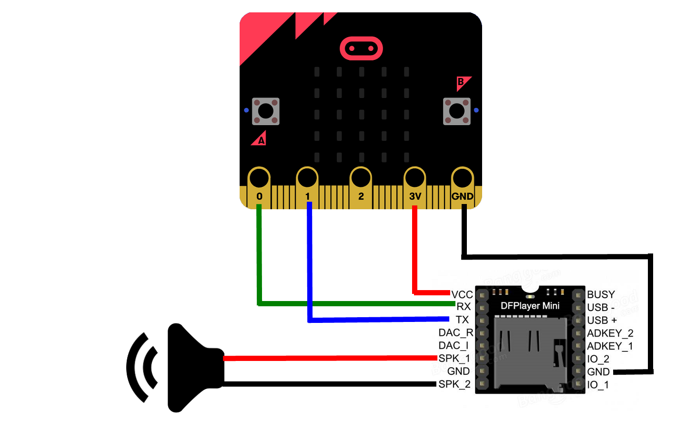
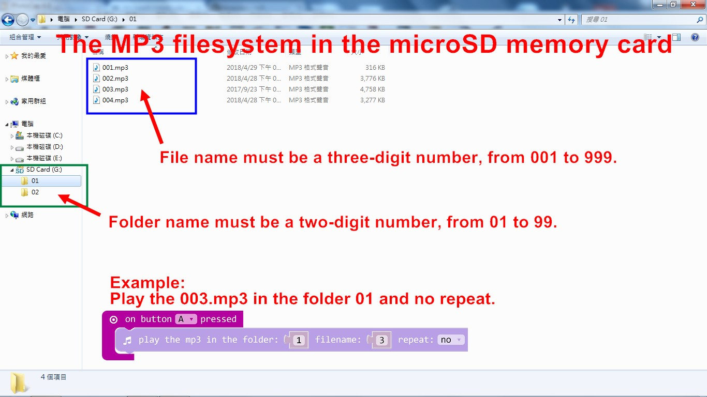
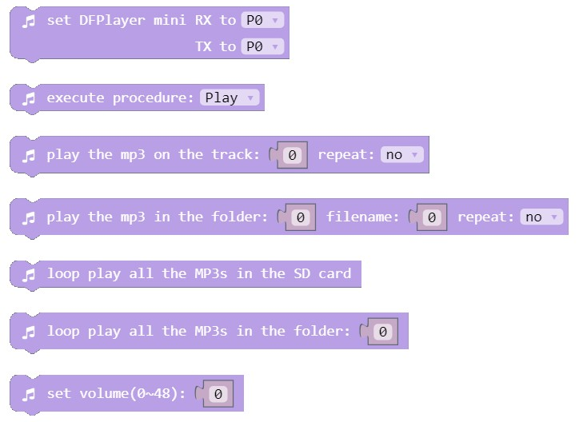
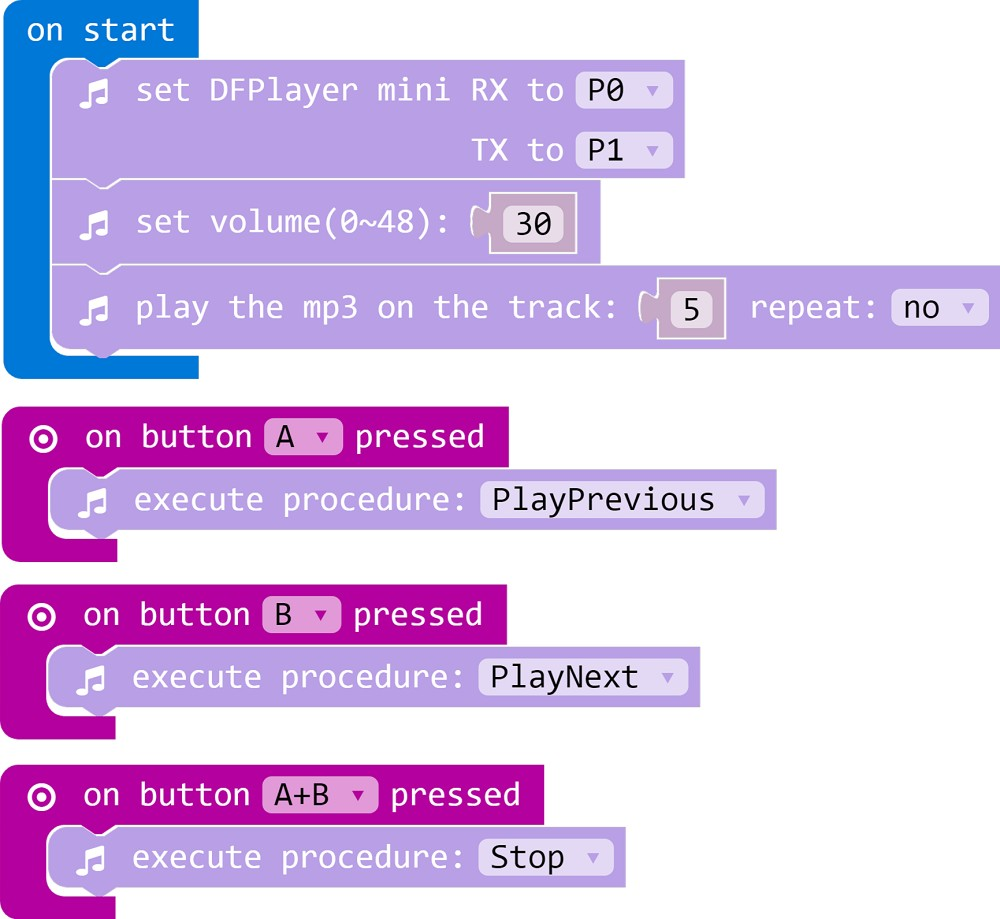
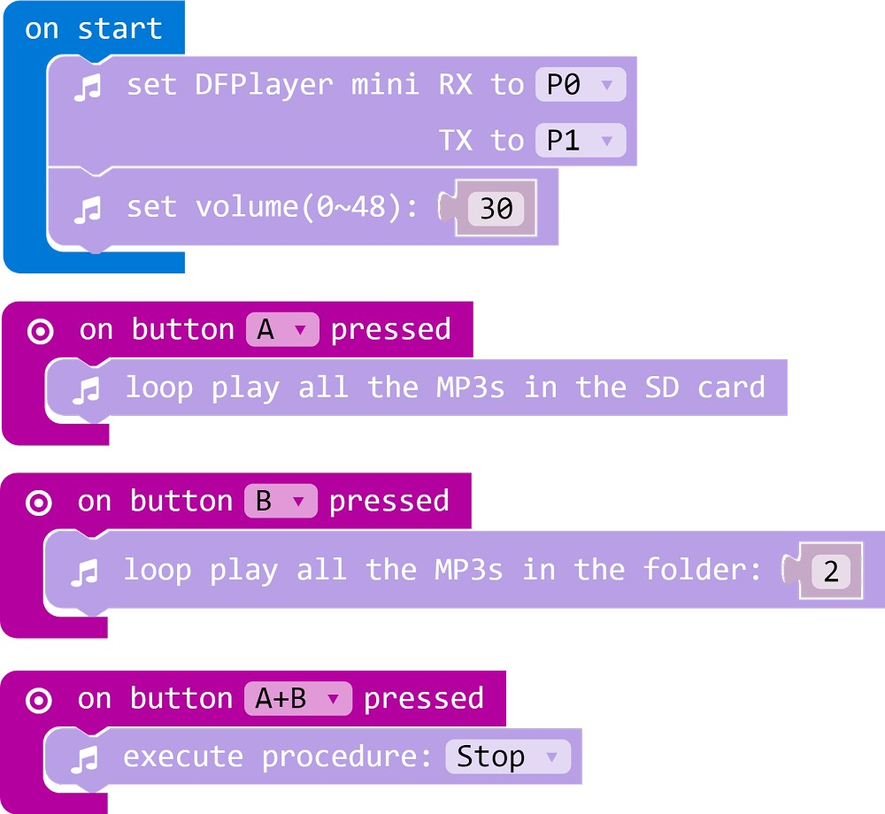

# dfplayer
這是專為micro:bit提供的MP3播放積木\
This is the package to play MP3 by using micro:bit attached DFPlayer mini

## Author
Liou Zheng-Ji\
劉正吉\
[my page, https://sites.google.com/jes.mlc.edu.tw/ljj/](https://sites.google.com/jes.mlc.edu.tw/ljj/)

## Description
The blocks can let you attch DFPlayer Mini to micro:bit, let the micro:bit play MP3 music.

## Video1
[](https://www.youtube.com/watch?v=ql-_ZhzFF68)

## Video2
[](https://www.youtube.com/watch?v=ahkVE9Gdb_s)

## Circuit


## The filesystem in the microSD card


## The MP3 player blocks


## Sample1


## Sample2


## License

MIT

## Supported targets

* for PXT/microbit
(The metadata above is needed for package search.)

```package
dfplayer=github:lioujj/pxt-mp3
```
